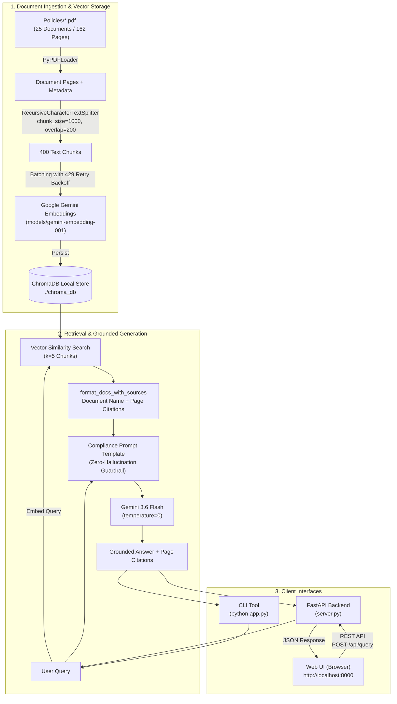

# ISO Policies RAG System — Technical Specification

## 1. Executive Summary

The **ISO Policies RAG System** is an enterprise-grade Retrieval-Augmented Generation (RAG) application developed in Python. It allows users to ask natural language questions against a repository of 25 corporate Information Security and ISO policy documents, receiving precise, fact-checked answers accompanied by document and page-level citations.

The solution provides two interaction modalities:
1. **Interactive Web Application**: A modern, responsive dark-mode chat interface with one-click suggestion chips, policy browsing catalog, and visual citation badges.
2. **Command-Line Interface (CLI)**: A scriptable terminal interface for automated demonstration and ad-hoc queries.

The solution is powered by **LangChain (v0.3)**, **Google Gemini (`gemini-3.6-flash`)**, **Google Generative AI Embeddings (`models/gemini-embedding-001`)**, **ChromaDB** for persistent vector storage, and **FastAPI** for backend service delivery.

---

## 2. Architecture & System Workflow

The system follows a decoupled, multi-tier RAG pipeline: **Document Ingestion & Indexing**, **Context Retrieval**, **Grounded Generation**, and **Multi-Client Delivery (Web UI & CLI)**.



---

## 3. Core Components

### 3.1. Ingestion Engine (`src/rag.py` -> `get_vectorstore`)
- **Document Loading**: Reads all `.pdf` documents within the `Policies/` directory using LangChain's `PyPDFLoader`. Supports loading either a single PDF file or an entire directory.
- **Text Chunking**: Employs `RecursiveCharacterTextSplitter`:
  - `chunk_size`: 1,000 characters
  - `chunk_overlap`: 200 characters
  - `separators`: `["\n\n", "\n", " ", ""]`
  - *Rationale*: Overlap prevents contextual truncation across clause boundaries in legal and compliance prose.
- **Metadata Tagging**: Each chunk is tagged with:
  - `source`: The policy document filename (e.g. `IncidentResponsePlan-v2.pdf`).
  - `policy_name`: Clean policy stem without file extension.
  - `page`: 0-indexed page number (converted to 1-indexed for citations).

### 3.2. Embedding & Vector Persistence (`chroma_db/`)
- **Embedding Model**: `models/gemini-embedding-001` producing 3,072-dimensional vector embeddings.
- **Persistent Database**: Uses `langchain-chroma` backed by local filesystem storage (`./chroma_db/`).
- **Cache-First Initialization**: On application startup, `get_vectorstore()` verifies whether `./chroma_db/` contains an existing collection. If found, it skips parsing and embedding entirely, loading the database in under two seconds.
- **Rate-Limit Resilience**: Incorporates an automated retry mechanism with incremental backoff (20s–50s) to handle free-tier API quotas (`429 ResourceExhausted`) gracefully during batch embedding.

### 3.3. Retrieval & Prompt Engineering (`src/rag.py` -> `build_rag_system`)
- **Retriever Configuration**: Exposes a similarity retriever configured to return top $k=5$ most relevant policy passages across all indexed documents.
- **Citation Formatter (`format_docs_with_sources`)**: Reconstructs retrieved chunks into a standardized context block:
  ```text
  [Policy Document: IncidentResponsePlan-v2.pdf | Page: 3]
  <chunk content>
  ```
- **Strict Compliance Prompting**:
  1. **Strict Context Adherence**: Instructs the model to answer *only* from the provided policy context.
  2. **Zero Hallucination Guardrail**: If an answer is not present in the context, the model explicitly outputs: *"This information is not covered in the provided policy document."*
  3. **Mandatory Citations**: Mandates explicit page tags (e.g. `[Page 3]`) for every policy statement.
  4. **Deterministic Output**: LLM temperature is set to `0` to eliminate creative variance and ensure audit-ready answers.

### 3.4. Backend Web Server (`server.py`)
A lightweight, asynchronous **FastAPI** server that bridges the RAG pipeline to web clients:
- **`POST /api/query`**: Accepts `{ "question": "..." }`, invokes the RAG engine, extracts source snippets and page references, and returns structured JSON:
  ```json
  {
    "question": "...",
    "answer": "...",
    "sources": [
      {
        "policy": "AI Use Policy.pdf",
        "page": 2,
        "snippet": "..."
      }
    ]
  }
  ```
- **`GET /api/policies`**: Returns catalog metadata (filename, title, file size in KB) for all 25 indexed policy documents.
- **Static Assets Mount**: Serves the frontend application files (`static/`) directly at the root path (`/`).
- **CORS Support**: Integrated `CORSMiddleware` allows cross-origin communication for future extensions or embedding into internal corporate portals.

### 3.5. Frontend User Interface (`static/`)
A modern, zero-build web interface built with standard web technologies:
- **`index.html`**: Semantic layout containing a branded navigation header, active policy count badge, interactive suggestion prompt chips, conversational message feed, auto-resizing input textarea, and a policy catalog modal.
- **`style.css`**: Premium dark-mode design system:
  - Custom HSL palette with deep slate canvas (`hsl(222, 47%, 7%)`) and glowing violet/cyan accents.
  - Glassmorphic message bubbles with border illumination.
  - Modern typography using Google Fonts (`Outfit` for headings, `Inter` for body).
  - Animated pulsing status indicators and bouncing typing dots.
  - Fully responsive grid and layout adapting to mobile, tablet, and desktop screens.
- **`app.js`**: Client controller handling:
  - Auto-resizing textarea with `Enter` to submit and `Shift + Enter` for new lines.
  - Quick-prompt chip interaction for instant demonstration queries.
  - Asynchronous query submission and dynamic loading animations.
  - Markdown rendering of headers, bold text, and lists using `marked.js`.
  - Dynamic citation badge generation with document names and page numbers.
  - Live policy catalog modal with real-time text filtering.

### 3.6. Command-Line Interface (`app.py`)
Provides automated demonstration and terminal-based query execution:
- **CLI Argument Mode**: Executes user queries directly:
  ```bash
  python app.py "What are the rules regarding password complexity?"
  ```
- **Demonstration Mode**: When executed with no arguments, runs a curated suite of cross-policy validation queries.
- **Reindex Flag (`--reindex`)**: Clears existing vector storage and performs a full re-embedding of the `Policies/` directory.

---

## 4. Corpus Overview

The indexed corpus consists of **25 ISO policy and procedure documents** comprising **162 pages** and **400 chunk vectors**:

| Category | Representative Documents |
| :--- | :--- |
| **Information Security & Governance** | `InformationSecurityPolicy-v1.3.pdf`, `InformationSecurityManagementSystem(ISMS)Plan2022-v3.pdf` |
| **Emerging Tech & Acceptable Use** | `AI Use Policy.pdf`, `AcceptableUsePolicy-v2.4.pdf` |
| **Identity & Access Management** | `PasswordPolicy-v1.3.pdf`, `SystemAccessControlPolicy-v2.pdf` |
| **Incident & Disaster Management** | `IncidentResponsePlan-v2.pdf`, `DisasterRecoveryPlan-v1.2.pdf`, `BusinessContinuityPlan-v1.6.pdf` |
| **Data Protection & Privacy** | `DataProtectionPolicy-v1.2.pdf`, `DataClassificationPolicy-v2.pdf`, `DataRetentionPolicy-v1.2.pdf`, `PersonalDataProcessingPolicy-v1.1.pdf` |
| **Infrastructure & Operations** | `BackupPolicy-v1.3.pdf`, `EncryptionPolicy-v1.2.pdf`, `LoggingandMonitoringPolicy-v2.pdf` |
| **Operational & Risk Management** | `ChangeManagementPolicy-v1.3.pdf`, `RiskAssessmentPolicy-v2.pdf`, `VendorManagementPolicy-v1.4.pdf`, `SoftwareDevelopmentLifeCyclePolicy-v1.2.pdf`, `VulnerabilityManagementPolicy-v2.1.pdf` |

---

## 5. Available Functionality & Usage Examples

### 5.1. Interactive Web Application
Users can interact with the system via a browser at `http://localhost:8000`:
- **One-Click Query Suggestions**: Click on curated prompt chips (e.g. *"Generative AI Policy & Rules"*, *"Password Complexity & MFA"*, *"Security Incident Reporting Workflow"*).
- **Formatted Policy Answers**: Responses render with bold highlights, bulleted requirements, and exact page citations.
- **Citation Badges**: Every generated answer includes verified policy badges (e.g. `[AI Use Policy.pdf (p. 2)]`) for compliance auditability.
- **Policy Catalog Explorer**: Open the **"Policy Catalog"** button in the header to search and browse all 25 indexed PDF documents.

### 5.2. Asking Specific Compliance Questions (CLI)
```bash
python app.py "What are the requirements for password complexity and multi-factor authentication?"
```
**Output:**
```markdown
Based on the provided policy context, here are the requirements:

### Password Complexity Requirements
* Passwords must contain at least 10 characters, including:
  * At least 1 uppercase letter [Page 1]
  * At least 1 lowercase letter [Page 1]
  * At least 1 digit [Page 1]
  * At least 1 non-alphanumeric character [Page 1]
* Do not reuse passwords for at least the last five changes [Page 1].

### Multi-Factor Authentication (MFA)
* MFA must be enabled for any systems providing the option [Page 1].
* MFA is strictly required for all remote access tools [Page 4].
```

### 5.3. Querying Cross-Policy Processes
```bash
python app.py "Which policy describes how to report security incidents?"
```
**Output:**
```markdown
Based on the provided policy document (IncidentResponsePlan-v2.pdf):

* Users must report any incident within 24 hours to the Information Security Manager [Page 2].
* Reporting can be conducted via email, a ticket in YouTrack, or anonymously through the PeopleForce portal [Page 2].
```

### 5.4. Guardrail Against Uncovered Queries
If a user asks a question not addressed in any policy (or outside the scope of the document), the model strictly declines rather than hallucinating:
```bash
python app.py "What is the policy for reimbursement of employee home internet expenses?"
```
**Output:**
```markdown
This information is not covered in the provided policy document.
```

---

## 6. Project Structure

```
LangChainIsoPoliciesProject/
├── Policies/               # 25 PDF policy documents (162 pages)
├── chroma_db/              # Persistent ChromaDB vector storage (Git-ignored)
├── src/
│   ├── __init__.py
│   └── rag.py              # Ingestion, ChromaDB loader, and LCEL chain logic
├── static/                 # Web Application Frontend Assets
│   ├── index.html          # Semantic HTML5 layout and modal dialogs
│   ├── style.css           # Modern dark-mode styling and responsive layout
│   └── app.js              # Client controller, markdown parser, and event handling
├── server.py               # FastAPI backend server with REST endpoints
├── app.py                  # Command-line entry point and execution script
├── requirements.txt        # Production dependencies
├── pyproject.toml          # Project configuration and metadata
├── .env.example            # Template for environment variables
├── .env                    # Local secrets (Google API key)
├── .gitignore              # Configured for .venv/, chroma_db/, and secrets
├── README.md               # User guide and quickstart
└── Specification.md        # Technical specification and architecture overview
```

---

## 7. Technology Stack & Dependencies

### Backend & AI Pipeline
- **Language Runtime**: Python 3.9+
- **LLM Orchestration**: `langchain` (v0.3.30), `langchain-community` (v0.3.31), `langchain-core` (v0.3.86)
- **Model Provider**: `langchain-google-genai` (v2.1.12)
  - Chat Model: `gemini-3.6-flash`
  - Embedding Model: `models/gemini-embedding-001` (3072 dimensions)
- **Vector Database**: `chromadb` (v1.5.9), `langchain-chroma` (v0.2.6)
- **Document Processing**: `pypdf` (v6.18.1)
- **Web Framework**: `fastapi` (v0.128.8), `starlette` (v0.49.3)
- **ASGI Server**: `uvicorn` (v0.39.0)
- **Environment Management**: `python-dotenv` (v1.2.1)

### Frontend Layer
- **Markup**: HTML5 (Semantic elements)
- **Styling**: Vanilla CSS3 (Custom properties, glassmorphism, flexbox/grid, keyframe animations)
- **Logic**: Vanilla JavaScript (ES6+, asynchronous Fetch API)
- **Typography**: Google Fonts (`Outfit`, `Inter`)
- **Markdown Rendering**: [Marked.js](https://cdn.jsdelivr.net/npm/marked/marked.min.js) (v15+)
